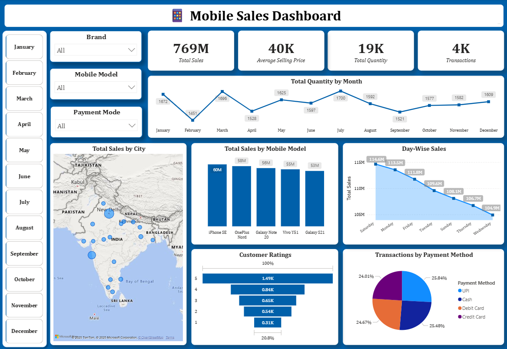

# 📊 Mobile Sales Dashboard

This Power BI dashboard analyzes mobile sales across different regions, categories, and time periods.  
It includes KPIs like total revenue, units sold, and profit margins.  

## Preview

## Files
- `Mobile Sales Dashboard.pbix` → Power BI dashboard  

## Tools Used
- Power BI  

